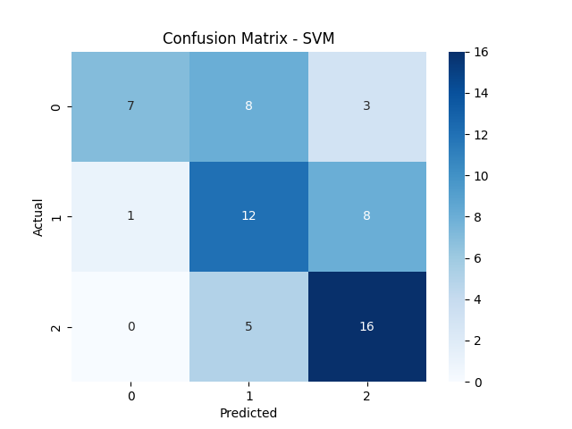
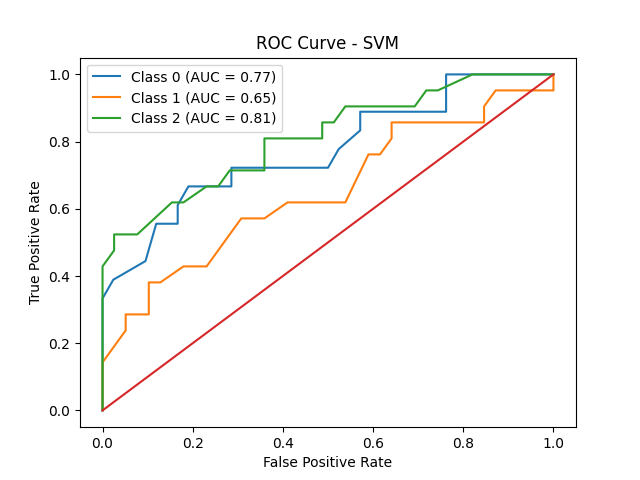
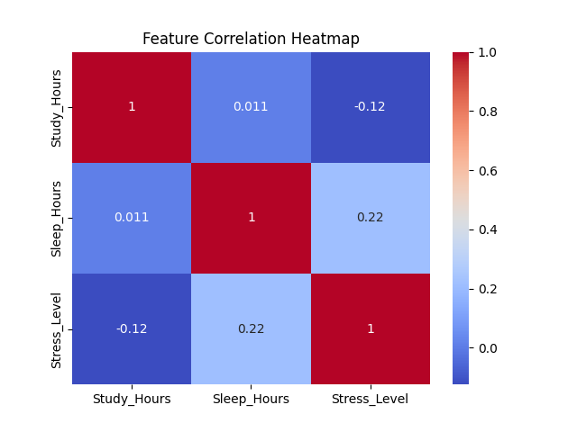

## 🌐 Live Demo
[Click here to try the app]https://student-stress-prediction-drae.onrender.com
# 📊 Student Stress Prediction using Machine Learning

## 🧠 Abstract
This project presents a comparative analysis of multiple machine learning models to predict student stress levels based on lifestyle indicators such as study hours and sleep hours. The study evaluates model robustness, generalization capability, and classification performance using structured evaluation metrics.

---

## 🎯 Problem Statement
Student stress is influenced by academic workload and sleep patterns. The objective of this project is to build a classification system that predicts stress levels (Low, Medium, High) using supervised machine learning techniques.

---

## 📁 Dataset Description

- Total Samples: 300
- Features:
  - Study_Hours
  - Sleep_Hours
- Target:
  - Stress_Level (Low, Medium, High)

The dataset was synthetically generated using rule-based logic combined with controlled randomness to simulate realistic academic stress conditions.

---

## ⚙️ Methodology

1. Data preprocessing and label encoding
2. Stratified train-test split (80-20)
3. Feature scaling using StandardScaler
4. Model training using:
   - Logistic Regression
   - Decision Tree
   - Random Forest
   - Support Vector Machine (SVM)
5. Model evaluation using:
   - Accuracy
   - Precision
   - Recall
   - F1-score
   - 5-fold Cross Validation
6. Visualization:
   - Confusion Matrix
   - ROC Curve
   - Correlation Heatmap

---

## 📊 Model Comparison Results

| Model | Accuracy | Cross-Val Score |
|-------|----------|----------------|
| Decision Tree | 0.60 | 0.53 |
| Random Forest | 0.58 | 0.54 |
| SVM | 0.58 | 0.58 |
| Logistic Regression | 0.51 | 0.50 |

SVM demonstrated better generalization performance based on cross-validation scores.

---

## 🔧 Hyperparameter Optimization

GridSearchCV was applied to tune hyperparameters for all models using 5-fold cross-validation.

Key tuned parameters:

- Logistic Regression → Regularization strength (C)
- Decision Tree → max_depth, min_samples_split
- Random Forest → n_estimators, max_depth
- SVM → C, kernel type (linear, rbf)

Despite optimization, performance improvements were marginal due to dataset simplicity and limited feature space.

This suggests model performance is constrained more by data complexity than model capacity.

## 📌 Performance Analysis

Despite hyperparameter tuning and feature engineering, model performance plateaued around 58–60% accuracy.

This suggests that the dataset's intrinsic structure and synthetic label generation logic limit achievable performance. The engineered features were largely derived transformations of original variables, providing limited additional information gain.

This highlights an important machine learning principle:

Model performance is often constrained more by data quality and feature diversity than algorithm complexity.

---

## 📈 Visualizations

### Confusion Matrix

### ROC Curve

### Correlation Heatmap

---

## 🛠 Tech Stack

- Python 3.11
- Pandas
- NumPy
- Scikit-learn
- Matplotlib
- Seaborn
- Joblib

---

## 🚀 How to Run

Clone repository:
git clone https://github.com/Jaswanth300/Student-Stress-Prediction

cd Student-Stress-Prediction

Install dependencies:
pip install -r requirements.txt

Train models:
python src/train.py

Generate visualizations:
python src/visualize.py

---

## 🌍 Real-World Applications

- Academic performance monitoring systems
- Student mental health analytics dashboards
- Early intervention systems in educational institutions
- AI-assisted academic advisory tools

---

## ⚠️ Limitations

- Synthetic dataset
- Only two features used
- Not validated on real-world student data

---

## 🔮 Future Improvements

- Integrate real-world survey dataset
- Add additional features (social activity, screen time, deadlines)
- Implement deep learning models
- Deploy as a web-based stress prediction tool
- Add fairness & bias analysis

---

## 👨‍💻 Author

Jaswanth  
B.Tech – Artificial Intelligence & Data Science  
GitHub-focused ML & Security Projects